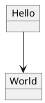

# gitbook-plugin-plantuml-svg
#### Inject PlantUML into GitBook as an SVG element.
[![NPM][shield-npm]][npm]
[![Travis CI][shield-travis]][travis]
[![Coveralls][shield-coveralls]][coveralls]

This is inspired by [dy93][github-dy93]'s work
[plugin-plantuml-cloud][github-plugin-plantuml-cloud]. There're already several
PlantUML plugins for GitBook out there. However, most of them relies on a local
[PlantUML][plantuml] & [Graphviz][graphviz].

The **plugin-plantuml-cloud** uses the public PlantUML services. It saves
people's effort to maintain the local **plantuml.jar**.

This plugin makes 2 additional improvements
1. Insert `<object data="..." type="image/svg+xml">` instead of ``, so that
the links in `SVG` still work.
2. Support standalone PlantUML file.

### Setup
```bash
# With NPM
$ npm install gitbook-plugin-plantuml-svg

# With Yarn
$ yarn add gitbook-plugin-plantuml-svg
```

In your `book.json`, add plantuml-svg to the plugin list
```json
{
  "plugins": ["plantuml-svg"]
}
```

### Usage
#### Standalone PlantUML file
Say, you have `graph/my-chart.puml`.


In your Markdown document, put following lines.
```markdown


```

By default, the file path is relative to the project root. If you want the path
to be relative to current document, do

```markdown


```

#### Inline PlantUML
The standalone PlantUML file is recommended for large graphs. However, for
simple graphs, you can also use inline plugin PlantUML.

```markdown

@startuml
object Hello
object World
Hello --> World
@enduml

```


[shield-travis]: https://img.shields.io/travis/wewei/gitbook-plugin-plantuml-svg.svg
[travis]: https://travis-ci.org/wewei/gitbook-plugin-plantuml-svg
[shield-coveralls]: https://img.shields.io/coveralls/github/wewei/gitbook-plugin-plantuml-svg.svg
[coveralls]: https://coveralls.io/github/wewei/gitbook-plugin-plantuml-svg
[shield-npm]: https://img.shields.io/npm/v/gitbook-plugin-plantuml-svg.svg
[npm]: https://www.npmjs.com/package/gitbook-plugin-plantuml-svg
[github-dy93]: https://github.com/dy93
[github-plugin-plantuml-cloud]: https://github.com/dy93/gitbook-plugin-plantuml-cloud
[plantuml]: http://plantuml.com/
[graphviz]: http://graphviz.org/
[bitjourney]: https://github.com/bitjourney/plantuml-service
[plantuml-server]: http://www.plantuml.com/plantuml/
